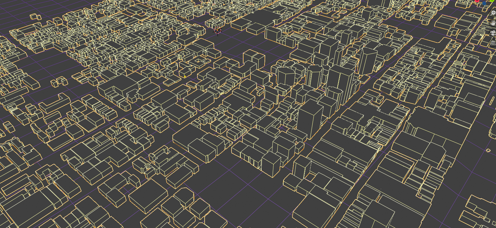

# Urban analysis with OSM data

## OSM

OpenStreetMap is a powerful map platform using community driven data. Understandably, OSM data provides opportunities for large scale urban analysis using open source data. Let's explore some of the data available for Australian cities and towns and see what can be done with it.

## Links

* OSM export - https://www.openstreetmap.org/export

## References

*
